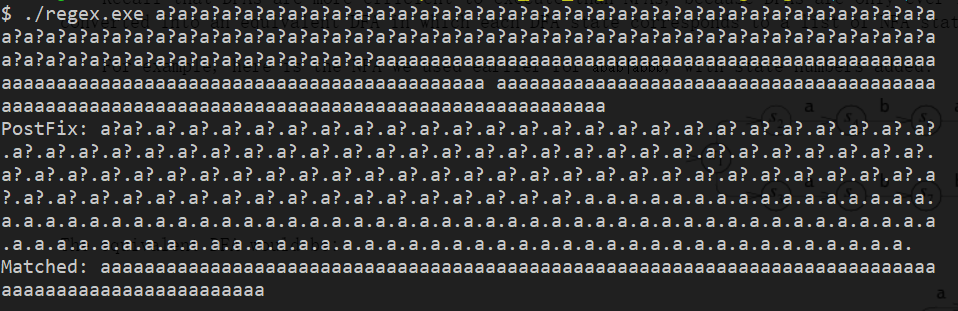
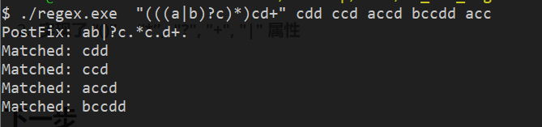

### 效果

### 功能

1. ######  匹配除了  "()+?*|."  的任意字符(ASCII) 

2. ######  实现了 “()”， “*”,  "?", "+", "|" 属性

### 下一步

1. ###### 添加 ' \ '  匹配 "^$()*+?.[{|" 原义

2. ###### 添加 ' ^ ', ' $ ' 属性

3. ###### 添加 {n}, {n,}, {n, m}  匹配多个

4. ###### 添加 ' . ' 匹配任意字符(除了回车换行)

5. ###### 添加 “[ab]” 匹配括号内任意字符

6. ###### 添加 “[a-c]” 属性

7. ###### 添加 “[ ^ab]” 不匹配括号内任一字符

8. ###### 添加 “[ ^a-c]” 属性 

9. ###### 使用C++编写并重构

10. ###### 决定是否将 NFA 转换为 DFA 进行匹配

### 参考资料

###### 1、https://swtch.com/~rsc/regexp/regexp1.html

###### 2、[https://zh.wikipedia.org/wiki/%E6%AD%A3%E5%88%99%E8%A1%A8%E8%BE%BE%E5%BC%8F](https://zh.wikipedia.org/wiki/正则表达式)